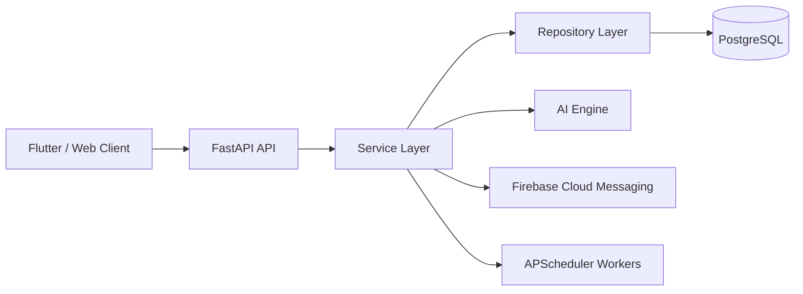

# CyberShield DN

AI-powered Community Cyber Threat Radar for Davao del Norte.


## Features

- AI Scam Detection
- RAG-first scanner investigations grounded in public documents and scam reports
- Scam Heatmap
- Cyber Weather
- Outbreak Detection
- Barangay Dashboard
- School Dashboard
- Push Notifications

## Architecture Diagram



## Folder Structure

```text
app/
├── api/
├── ai/
├── core/
├── database/
├── models/
├── repositories/
├── schemas/
├── services/
├── utils/
└── workers/
```

## Installation

### Docker

```bash
docker compose up --build
```

### Local Installation

```bash
python -m venv .venv
source .venv/bin/activate
pip install -r requirements.txt
```

### Alembic Migration

```bash
alembic revision --autogenerate -m "initial migration"
alembic upgrade head
```

### Run API

```bash
uvicorn app.main:app --reload
```

### API Documentation

- Swagger UI: `http://localhost:8000/docs`
- ReDoc: `http://localhost:8000/redoc`

## Environment Variables

Copy `.env.example` to `.env` and configure:

- `DATABASE_URL`
- `SECRET_KEY`
- `FIREBASE_PROJECT_ID`
- `FIREBASE_CREDENTIALS_PATH`
- `ALLOWED_ORIGINS`
- `UPLOAD_DIR`
- `AI_MODEL`, `AI_API_KEY`, `GROQ_BASE_URL`, and `GROQ_TIMEOUT` for RAG scanner investigations

Scanner endpoints investigate submitted URLs, SMS, QR payloads, and text with the
configured chat model. Retrieval uses sanitized public documents and pending or
verified scam-report signals; user identities, contact details, conversations,
and audit data are excluded. If the database or model is unavailable, the
existing deterministic detectors provide a bounded fallback response.

## License

MIT
